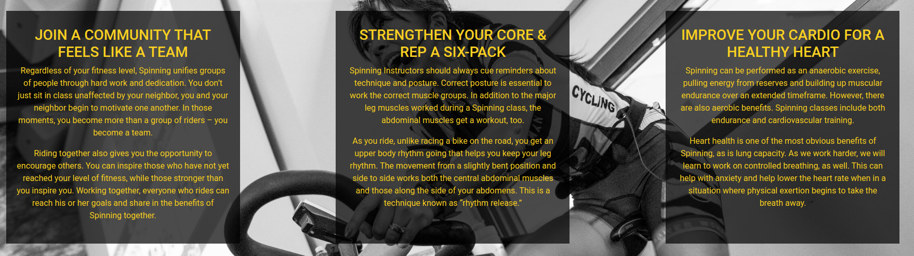
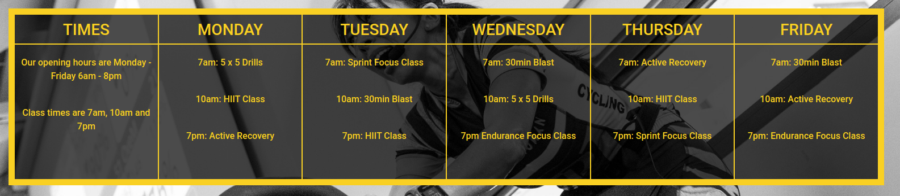
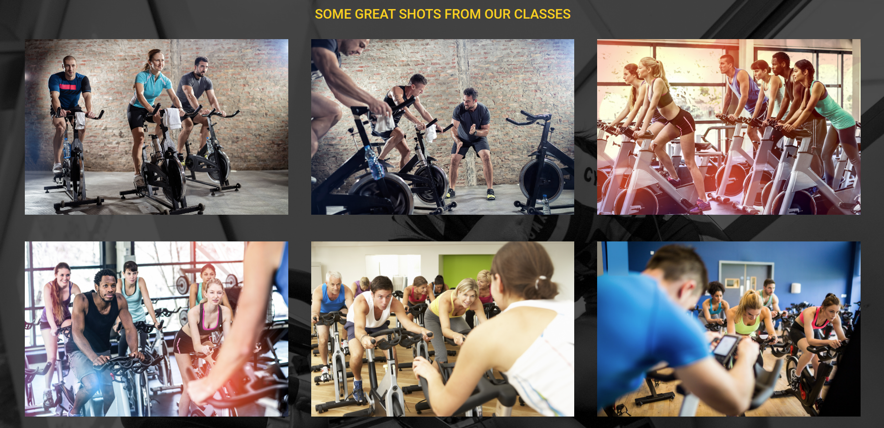
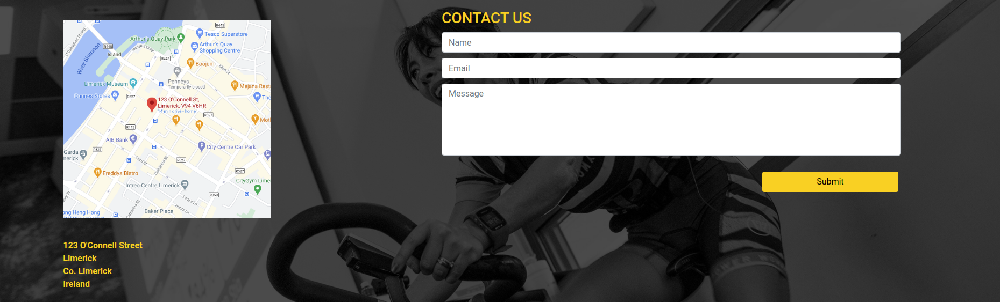
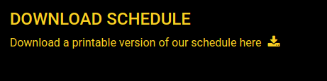

# Milestone Project 1
This website aims to provide information about spinning classes to customers. This includes enticing new customers by providing information on the benefits of spinning as well as making information on class schedules available to existing customers

## UX

### Customer Goals
#### New customer goals are
- Learn about the benefits of spinning
- Find out when and where the classes are happening
- See the setup/layout for a class
- Contact the organiser if I have any questions
#### Existing customer goals are
- Know the schedule for classes
- Contact the organiser
#### Developer and Business goals are
- Ensure information on spinning is clearly presented to customers
- Make the time and location of the classes easily accessible to all customers
- Showcase the class
- Make the business easily contactable and easy to find

### User stories
#### As a new customer I want to...
1. Find out more info about spinning
2. See the times the classes are at
3. Find the location of the facitlity
4. See pictures of what a typical class looks like
5. Send a message to the organiser to ask questions

#### As an existing customer I want to...
1. Be able to check the schedule online
2. Download a printable copy of the schedule
3. Send a message to the organiser

<!-- 

 -->

### Wireframes
Wireframes can be viewed [here](wireframes/ms1.pdf)

## Features

In this section, you should go over the different parts of your project, and describe each in a sentence or so.
 
### Existing Features
- Navigation Menu - allows users to navigate to each page of the site
- Footer - provides a downloadable schedule to users and gives links to social media sites
- Home Page - provides info to the user and adapts to various screen resolutions
- Schedule - a table with class times which will stack in a single column on smaller screens
- Gallery - displays images in a responsive layout
- Contact - a contact form for users to get in touch

## Technologies Used

In this section, you should mention all of the languages, frameworks, libraries, and any other tools that you have used to construct this project. For each, provide its name, a link to its official site and a short sentence of why it was used.

- [HTML](https://www.w3.org/)
    - The project uses **HTML** for the content of the site.
- [CSS](https://www.w3.org/)
    - The project uses **CSS** for the layout of the site.
- [hover.css](https://cdnjs.com/libraries/hover.css/2.1.0)
    - The project uses **hover.css** for changes to elements when you hover your mouse over them.
- [Bootstrap](https://getbootstrap.com/)
    - The project uses **Bootstrap** to give a responsive layout.
- [Font Awesome](https://fontawesome.com/)
    - The project uses **Fontawesome** to to add icons.

## Testing

1. Contact form:
    1. Go to the "Contact Us" page
    2. Try to submit the empty form and verify that an error message about the required fields appears
    3. Try to submit the form with an invalid email address and verify that a relevant error message appears
    4. Try to submit the form with all inputs valid and verify that no errors appears.

2. All pages:
    1. Go to each page and run Lighthouse tests on all pages
    2. Go to each page and ensure that all links on that page work
    3. Ensure download and social media links open in new tab

3. Browser and screen sizes:
    1. The site works in all browsers tested (Firefox, Chrome, Opera)
    2. The site works well at various resolutions (tested via dev tools)

4. Problems encountered:
    1. Text on schedule headings was spilling into adjacent elements on some screen resolutions typical for tablets. This was fixed by decreasing the font size for the resolutions where the issue occurred
    2. When drawing up wireframes I had intended to use a "burger menu" for navigation on mobile. When I researched this further I found that Javascript was required so I opted for a stacked navigation instead

## Deployment

### To contribute:
1. Clone the repository using [this guide](https://docs.github.com/en/github/creating-cloning-and-archiving-repositories/cloning-a-repository)
2. Add the [Gitpod browser extension](https://www.gitpod.io/docs/browser-extension/)
3. If prompted, log in to Gitpod using your Github account

### To deploy the site

This section should describe the process you went through to deploy the project to a hosting platform (e.g. GitHub Pages or Heroku).

In particular, you should provide all details of the differences between the deployed version and the development version, if any, including:
- Different values for environment variables (Heroku Config Vars)?
- Different configuration files?
- Separate git branch?

In addition, if it is not obvious, you should also describe how to run your code locally.

## Credits
- picresize.com was used for rescaling images

### Content
- The gallery grid/css was copied from https://www.w3schools.com/howto/howto_css_image_grid_responsive.asp
- Benefits of spinning taken from https://spinning.eu/spinlife/the-top-10-benefits-of-spinning-class/

### Media
- The photos used in this site were obtained from ...
- http://clipart-library.com/clipart/365451.htm
- https://unsplash.com/photos/JNAr_lyo6Jo
- https://shutterstock.com

### Acknowledgements

- I received inspiration for this project from https://spinstream.co.uk/
